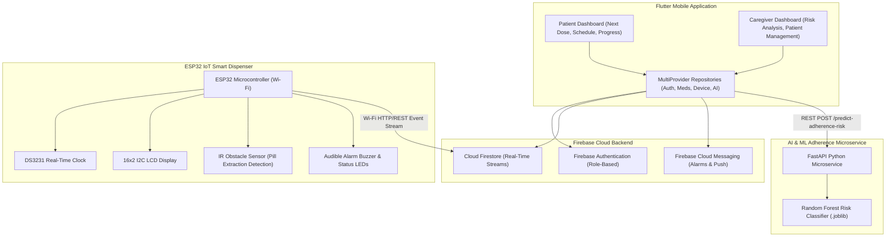

# Smart Medical Management System
### *IoT-Based Medicine Reminder & AI-Powered Patient Adherence Monitoring System*

An end-to-end, production-grade embedded systems capstone and digital health platform combining **Flutter**, **Firebase Cloud Firestore**, an **ESP32 Smart Dispenser (with DS3231 RTC, 16x2 LCD, IR Pill Sensor, and Buzzer)**, and a **FastAPI Random Forest ML Microservice** for adherence-risk prediction.

---

## Architecture Overview



---

## Key Features

### 1. Patient Experience
* **Next Dose Countdown Card**: Real-time relative countdown (*"Next dose in 42 minutes"*), dosage, and quick "Mark Taken" trigger.
* **Today's Schedule**: Accessible cards showing medicine name, dosage, scheduled time, and status badges (**UPCOMING**, **TAKEN**, **MISSED**, **LATE**).
* **Live Adherence Progress**: Circular / linear progress tracking daily dose completion percentage.
* **Prescription Viewer**: List of active prescriptions with full doctor instructions.
* **Filterable History**: View past intake records by Daily, Weekly, or Monthly intervals.
* **Device Status Indicator**: Live ESP32 connection badge with heartbeat timestamp (*"Connected · Last synced 20 sec ago"*).

### 2. Caregiver / Clinician Experience
* **Clinical Multi-Patient Overview**: Monitored patient count, average adherence rate, high-risk flags, and missed dose counters.
* **AI Adherence Risk Analysis**: Machine-learning-powered risk classifier (**LOW / MEDIUM / HIGH**) with explainable reasoning and safety disclaimers.
* **Prescription Management**: Add, update, and remove medicine prescriptions and schedules in real time.
* **Patient Compliance Trends**: 7-day visual adherence charts and patient compliance rankings.
* **Automated Alert Escalation**: Real-time push notifications for missed doses and hardware disconnects.

### 3. ESP32 IoT Smart Dispenser
* **DS3231 RTC Precision Clock**: Accurate offline timekeeping independent of internet dropouts.
* **16x2 I2C LCD Display**: Displays live clock, upcoming dose, and status warnings.
* **Infrared (IR) Sensor Pill Detection**: Automatically detects hand/pill retrieval from the dispenser tray and uploads timestamps directly to Firebase.
* **Dual Status LEDs & Piezo Buzzer**: Audio-visual alert sequences during scheduled dose windows.

### 4. Machine Learning Adherence Microservice
* **Random Forest Classifier**: Trained on adherence percentage, missed dose counts, late doses, and ratio metrics.
* **FastAPI Microservice**: High-performance asynchronous endpoint (`POST /predict-adherence-risk`).
* **Offline Fallback Heuristics**: The Flutter app includes resilient local fallbacks in case the microservice is temporarily unreachable.

---

## Directory Structure

```text
d:\Embded System/
├── flutter_app/                        # Flutter Mobile Application
│   ├── pubspec.yaml                    # Production dependencies
│   ├── analysis_options.yaml           # Strict Dart linter rules
│   ├── lib/
│   │   ├── main.dart                   # Application entrypoint
│   │   ├── app.dart                    # Top-level MaterialApp & MultiProvider setup
│   │   ├── core/
│   │   │   ├── constants/              # AppColors, AppConstants
│   │   │   ├── theme/                  # Material 3 Theme & AppTextStyles
│   │   │   ├── utils/                  # DateFormatter, ValidationHelper
│   │   │   └── services/               # NotificationService
│   │   ├── data/
│   │   │   ├── models/                 # UserModel, PatientModel, MedicineModel, LogModel, etc.
│   │   │   ├── repositories/           # Auth, Medicine, Patient, Device, AI, Notification Repos
│   │   │   └── services/               # DemoDataService, FirestoreService
│   │   └── ui/
│   │       ├── common/                 # Reusable Design System Widgets (MedicineCard, RiskCard, etc.)
│   │       └── features/
│   │           ├── splash/             # SplashView
│   │           ├── onboarding/         # OnboardingView (3-step walkthrough)
│   │           ├── auth/               # LoginView, RegisterView, ForgotPasswordDialog
│   │           ├── patient/            # Patient dashboard, medicines, history, alerts, profile
│   │           └── caregiver/          # Caregiver dashboard, patients, details, reports, profile
│   └── test/                           # Automated Flutter unit tests
├── ai_service/                         # Python FastAPI ML Microservice
│   ├── requirements.txt
│   ├── app/
│   │   ├── main.py                     # FastAPI application & routes
│   │   ├── schemas.py                  # Pydantic request/response schemas
│   │   └── ml/
│   │       ├── train_model.py          # Random Forest training & export script
│   │       ├── model_service.py        # Inference pipeline & explanation generator
│   │       └── adherence_model.joblib  # Serialized Scikit-Learn model
│   └── tests/                          # Model & API test cases
├── esp32_firmware/                     # ESP32 C++ Arduino Firmware
│   ├── smart_medicine_box.ino          # Main firmware loop & hardware control
│   └── config.h                        # Wi-Fi, Firebase credentials & GPIO pin definitions
├── firestore.rules                     # Role-based Cloud Firestore security rules
├── firestore.indexes.json              # Firestore composite query index definitions
└── README.md                           # Master project documentation
```

---

## Setup & Execution Guide

### 1. Flutter Mobile Application
1. Open terminal in `flutter_app/`:
   ```bash
   cd flutter_app
   flutter pub get
   flutter run
   ```
2. **Instant Demo Mode**: On the Login screen, click **"Demo Patient"** or **"Demo Caregiver"** for immediate access with preloaded clinical data.

### 2. Python AI Adherence Microservice
1. Open terminal in `ai_service/`:
   ```bash
   cd ai_service
   pip install -r requirements.txt
   ```
2. Train or update the ML model:
   ```bash
   python -m app.ml.train_model
   ```
3. Start the FastAPI server:
   ```bash
   uvicorn app.main:app --host 0.0.0.0 --port 8000 --reload
   ```
4. Run ML test cases:
   ```bash
   python -m tests.test_model
   ```

### 3. ESP32 Hardware Setup & Wiring
| Component | ESP32 GPIO Pin |
| :--- | :--- |
| **I2C SDA (LCD 16x2 & DS3231)** | GPIO 21 |
| **I2C SCL (LCD 16x2 & DS3231)** | GPIO 22 |
| **IR Obstacle Sensor (OUT)** | GPIO 18 |
| **Piezo Buzzer (+)** | GPIO 19 |
| **Green Status LED (+)** | GPIO 23 |
| **Red Alert LED (+)** | GPIO 4 |

1. Open `esp32_firmware/smart_medicine_box.ino` in Arduino IDE.
2. Install required libraries: `LiquidCrystal_I2C`, `RTClib`, `WiFi`, `HTTPClient`.
3. Configure your Wi-Fi credentials in `config.h`.
4. Flash to ESP32 DevKit V1.

---

## Medical Disclaimer
> **IMPORTANT**: This system is designed solely for medication reminder assistance, adherence tracking, and clinical monitoring. The AI-generated adherence risk scores and insights do **NOT** constitute medical diagnosis or clinical treatment recommendations.
